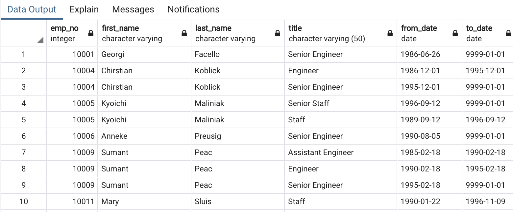

# Pewlett Hackard Analysis

## Overview of the analysis: 
The purpose of this analysis is to provide Bobby, an HR Analyst of Pewlett Hackard, a list of employees who will be retiring in the next few years. This list is used to plan for how many positions they need to fill and create a Mentorship Program. The full SQL code can be found here: [Employee_Database_challenge.sql](https://github.com/nguyencao247/Pewlett-Hackard-Analysis/blob/main/Queries/Employee_Database_challenge.sql)

## Results: 
The results from this project include the following four csv files: 

- [retirement_titles.csv](https://github.com/nguyencao247/Pewlett-Hackard-Analysis/blob/main/Data/retirement_titles.csv): is a list of all employees and their titles who will be retiring.

- [unique_titles.csv](https://github.com/nguyencao247/Pewlett-Hackard-Analysis/blob/main/Data/unique_titles.csv): is a list of all employees who will be retiring and their most current job title.

- [retiring_titles.csv](https://github.com/nguyencao247/Pewlett-Hackard-Analysis/blob/main/Data/retiring_titles.csv): the number of employees retiring grouped by their job title.

- [mentorship_eligibilty.csv](https://github.com/nguyencao247/Pewlett-Hackard-Analysis/blob/main/Data/mentorship_eligibilty.csv): a list of employees who are eligible for the mentorship program (those born between January 1, 1965 and December 31, 1965).

## Summary: 
### How many roles will need to be filled as the "silver tsunami" begins to make an impact?
According to retiring_titles.csv above, Pewlett Hackard needs to fill  at least 90,398 positions when employees start to retire, the most being Senior Engineers (33% of the retirees).

### Are there enough qualified, retirement-ready employees in the departments to mentor the next generation of Pewlett Hackard employees?
There are 240,124 total Pwelett Hackard employees. Out of that, 90,398 are retiring (which is 38% of their entire workforce). According to [mentorship_eligibilty.csv](https://github.com/nguyencao247/Pewlett-Hackard-Analysis/blob/main/Data/mentorship_eligibilty.csv), there are only 1,549 employees that are eligible to be mentors. If the organization were to replace all of their retirees, each mentor would have about 59 mentees! That’s way too many mentees. Pewlette Hackard should be more prepared for this large number of upcoming retirees. 
